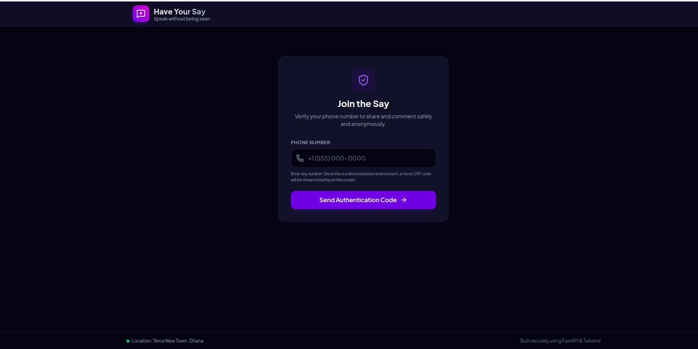
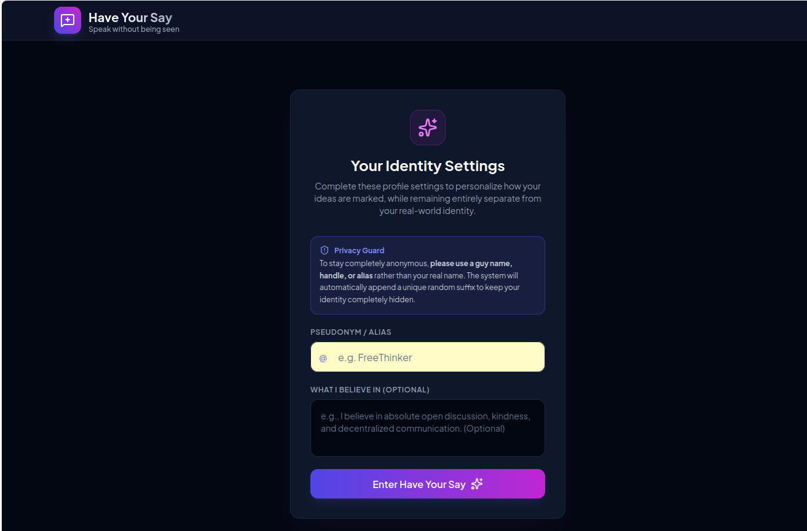
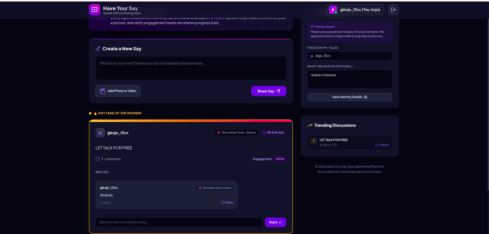
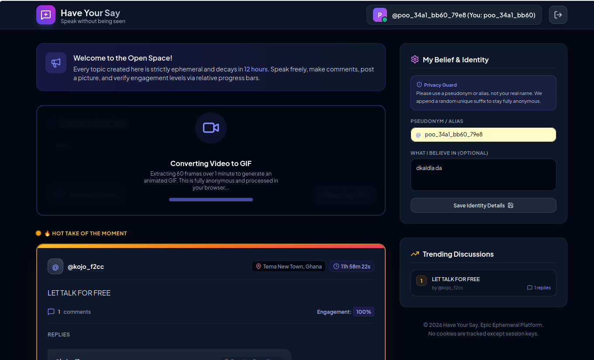

# Have Your Say

  

## Anonymous Truth-Driven Discussion Platform

**Have Your Say** is a next-generation discussion platform designed to enable **anonymous expression, community-driven truth validation, and responsible discourse**.

Unlike traditional social platforms that prioritize popularity, *Have Your Say* focuses on **credibility, verification, and meaningful engagement**.

---

## Core Concept

Users share statements, opinions, or claims—referred to as **“Says”**—through:
- Text
- Images
- Short-form videos (max 60 seconds)

Each “Say” can be evaluated by the community through:
- **Verify** (agreement / support)
- **Disverify** (challenge / disagreement)

This creates a **dynamic, community-driven truth layer**, where credibility evolves over time.

---

## Identity & Anonymity Model

- Users participate **anonymously by default**
- The system assigns **temporary identities**
- Identities refresh:
  - On login, or
  - Every 12 hours

### Benefits
- Reduces bias and social pressure  
- Encourages honest participation  
- Prevents long-term tracking of users  

---

## Reputation & Credibility System

The platform is built on a **credibility-first model**, not likes or followers.

Each user has a **hidden reputation score** based on:
- Accuracy of their “Says”
- Ratio of verified vs disverified content
- Consistency over time

### Weighted Validation
- Votes are **not equal**
- Higher credibility users have **greater influence**

---

## Single Source of Truth Mechanism

Each post is dynamically classified as:

- **Verified** → Trusted by the community  
- **Disputed** → Mixed feedback  
- **Disverified** → Rejected or challenged  

This system aims to:
- Reduce misinformation  
- Promote evidence-based discussion  
- Encourage critical thinking  

---

## Private Discussion Privileges

Users with strong credibility unlock:

### 🔥 12-Hour Private Discussion Sessions

Features:
- Create invite-only rooms  
- Discuss sensitive or high-impact topics  
- Engage with selected participants  

This acts as a **reward mechanism for high-quality contributions**.

---

## Content System

Supported formats:
- Text posts  
- Image uploads  
- Video uploads (max 60 seconds)  

### Media Optimization
- Videos are automatically converted to GIF format  
- Ensures fast loading and efficient storage  

---

## Privacy & Content Lifetime

- All posts are **temporary (12-hour lifespan)**
- Content is automatically deleted after expiration
- Platform is designed for **real-time discussions**, not permanent records

> Note: Temporary content does not prevent screenshots or external sharing.

---

## Features

- Anonymous participation  
- Temporary discussions (12 hours)  
- Community-driven verification system  
- Credibility-based reputation model  
- Private discussion sessions  
- Photo and video sharing  
- Automatic video-to-GIF conversion  
- Mobile-friendly interface  

---

## Purpose

Have Your Say aims to:

- Enable open and honest conversations  
- Create a **truth-validation layer** for discussions  
- Reduce misinformation through collective input  
- Provide a safe space for sensitive topics  
- Encourage responsible and thoughtful communication  

---

## Responsible Usage

Anonymity does not remove responsibility.

Content that promotes:
- Threats  
- Harassment  
- Hate speech  
- Illegal activities  
- Harm to individuals or groups  

may be restricted or removed.

---

## Important Notice

Freedom of speech allows expression, but not freedom from consequences.

> "Freedom of speech is free, but consequences are not."

Users are responsible for ensuring their content complies with applicable laws and respects others.

---

## Download Control

Topic creators can control content export:

- Enable download → Users can export discussions (JSON / CSV)  
- Disable download → Export is restricted  

> Note: This does not prevent screenshots or external capture.

---

# Application Preview

## Logo

  

---

## Screenshots

### Login Page

  

  

---

### Main Discussion Page

  

---

### Anonymous Post Page

  

---

## Philosophy

- Not popularity-driven  
- Not identity-driven  
- **Credibility-driven**  

---

## Tagline

**Speak freely. Verify responsibly. Build truth together.**